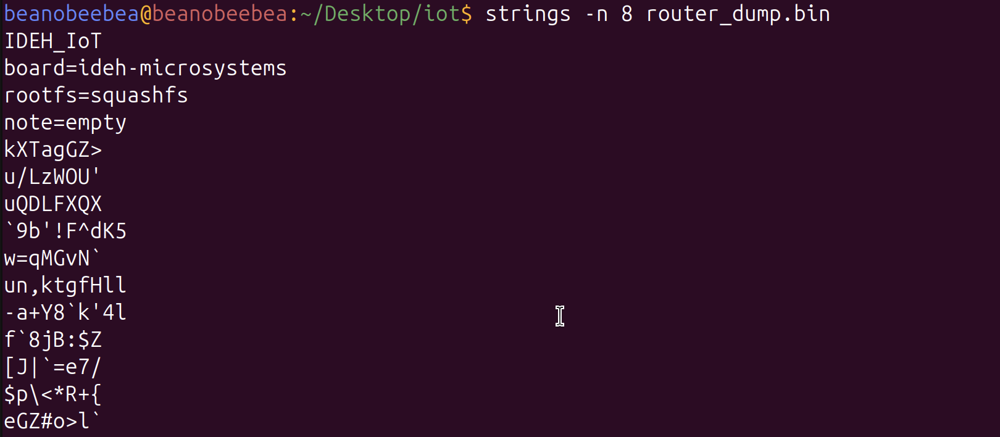
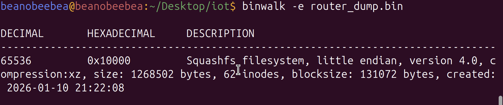
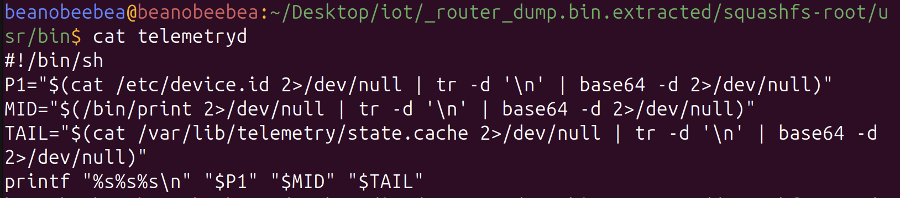
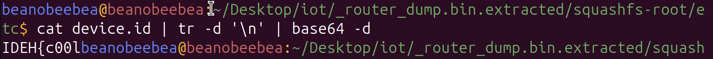
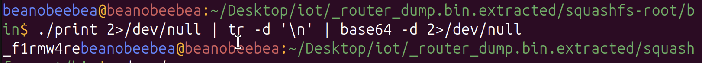
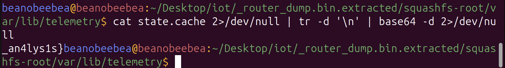

# I in Iot stands for Security - IDEH 2026 Writeup

**Category:** [[Misc]]   
**Flag:** `IDEH{c00l_f1rmw4re_an4lys1s}`

## I. Overview

The challenge provides a binary file, `router_dump.bin`, supposedly extracted from an insecure IoT device. Our goal is to analyze the firmware and find the hidden flag.

## II. Initial Reconnaissance

We start by running `strings` to see if there is any low-hanging fruit or metadata that gives away the architecture or file structure.

Bingo! That line `rootfs=squashfs` is the most important piece of information here. It confirms that there is a compressed Linux filesystem hidden inside the `.bin` file.

*Note: The `-n 8` flag tells strings to only show us sequences of 8+ printable characters. Anything shorter is probably just random noise.*

## III. Firmware Analysis

We'll use `binwalk`, a powerful tool for analyzing and extracting embedded files from binary images. The `-e` flag tells `binwalk` to automatically extract any filesystems it finds:

### What just happened?

`binwalk` scanned the binary and discovered:
Binwalk scanned through the binary byte-by-byte and found our SquashFS filesystem at offset `0x10000` (65536 bytes in). It then:

- Recognized it as SquashFS v4.0 with `xz` compression
- Decompressed the whole thing
- Dumped it into a folder `_router_dump.bin.extracted` with an underscore prefix (binwalk's way of saying "I extracted this")

The filesystem is relatively small—only 62 inodes (files/directories) and about 1.2MB. Should be easy enough to explore

### Exploring the filesystem

Now I can navigate the extracted filesystem just like a normal Linux directory.

A bit of exploring leads me to this interesting script:

This script, `telemetryd`, is a shell script that constructs a string by pulling data from three different locations, decoding them from **Base64**, and stitching them together. This looks like my flag assembly mechanism.

Let's decode each part.

## IV. Flag Assembly

### Part 1: `/etc/device.id`

The first part of the flag is: `IDEH{c00l`

### Part 2: `/bin/print` output

The middle part of the flag is: `_f1rmw4re`

### Part 3: `/var/lib/telemetry/state.cache`

The tail of the flag is: `_an4lys1s}`

## V. Conclusion

This is a classic "Security through Obscurity" play. The developer didn't want the flag to be searchable as one single string

By breaking it into three parts and encoding them, they hide it from simple scanners. 
While this might stop lazy attackers, standard forensic tools made the discovery straightforward.

[[IDEH2026]]